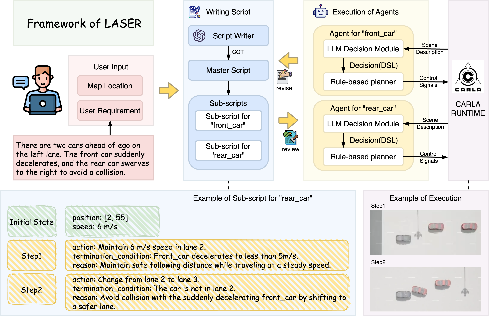

# LASER: SCRIPT EXECUTION BY AUTONOMOUS AGENTS FOR ON-DEMAND TRAFFIC SIMULATION
> To make a great film, you need three things–the script, the script and the script. – Alfred Hitchcock

https://github.com/user-attachments/assets/bad8a396-6ac1-4a88-b36b-83c77172b194

## Framework Overview



## Experiment Results

Experiments show that LASER can generate scripts effectively based on user requirements, with only 3.18% of the final script's characters input by the user. It executes the scripts efficiently, achieving a 90.48% success rate and averaging 1606.09 tokens per simulation second per agent.

Experiment records are available in the `experiment_result `folder.

## Getting Started
### Environment
#### clone the repo
```
git clone https://github.com/CXYyp5SkNg/CXYyp5SkNg.github.io.git
git submodule update --init --recursive
```
#### create conda environment
```
conda create -n laser python=3.8
conda activate laser
pip install -r requirements.txt 
```

#### setup and run CARLA 0.9.15
[setup Docker](https://docs.docker.com/engine/install/)

[setup NVIDIA Container Toolkit](https://docs.nvidia.com/datacenter/cloud-native/container-toolkit/latest/install-guide.html)

```
docker build -t carla_amap:0.9.15 .
docker run --privileged --gpus all --net=host -e DISPLAY=$DISPLAY carla_amap:0.9.15 /bin/bash ./CarlaUE4.sh
```

#### exit CARLA
```
docker stop $(docker ps -q)
```

#### set up openai key
```
export OPENAI_API_KEY=sk-your-apikey
```

#### set up [Interfuser](https://github.com/opendilab/InterFuser) as test subject
```
conda activate laser
cd interfuser
pip install -r requirements.txt
python setup.py develop # this will install the customized timm where Interfuser lies in

export PYTHONPATH=$PYTHONPATH:./scenario_runner
export PYTHONPATH=$PYTHONPATH:./PythonAPI/carla/
export PYTHONPATH=$PYTHONPATH:./leaderboard
```

Download model weights at [here](http://43.159.60.142/s/p2CN). Then move the model to leaderboard/team_code/interfuser.pth.tar.

### Generate Script with LASER
```
mkdir laser_scenes/your_scene_name
cp laser_scenes/Swerve/UserPrompt.txt laser_scenes/your_scene_name
vim laser_scenes/your_scene_name/UserPrompt.txt
python3 laser_sg.py -s "your_scene_name"
```

### Execute Script with LASER
```
python3 laser_se.py -r T04Highway -s "laser_scenes/Swerve/script.json" -t 10
```

After the execution, check `se_records` folder for generated video.

